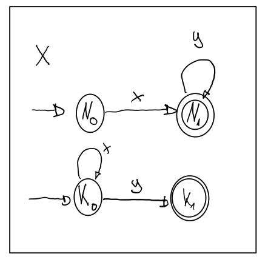
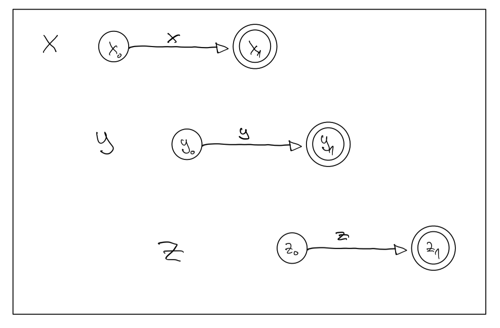
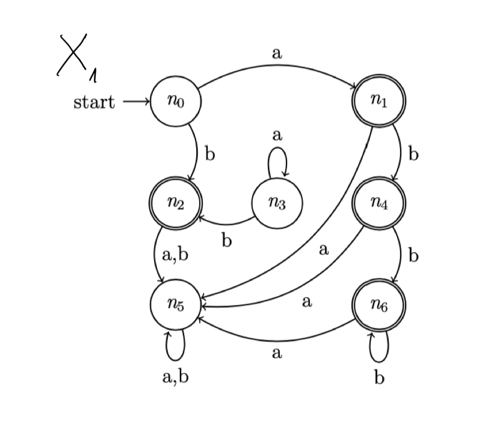
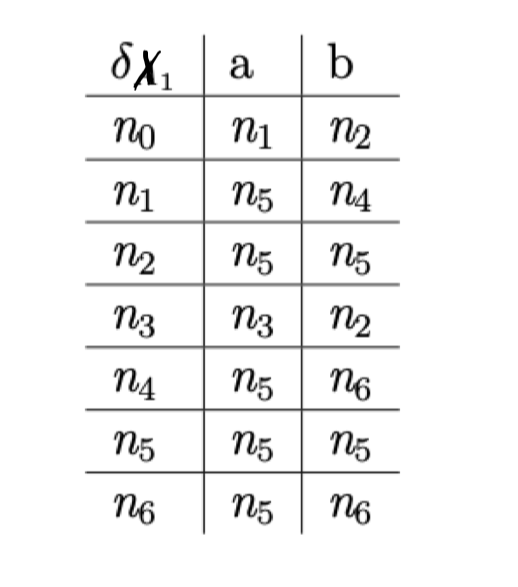
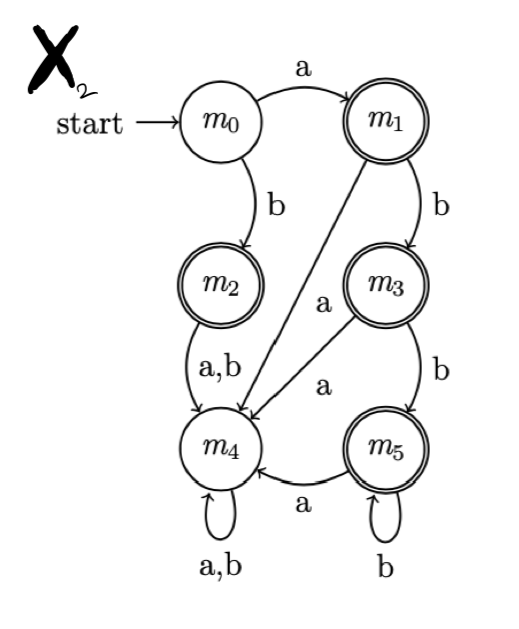
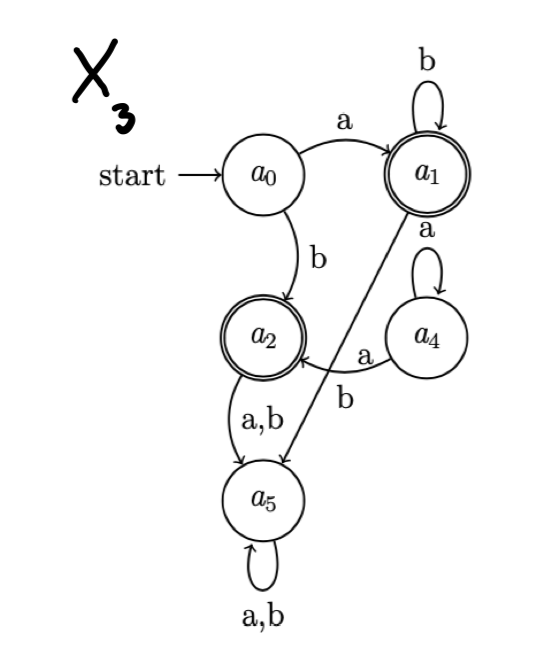
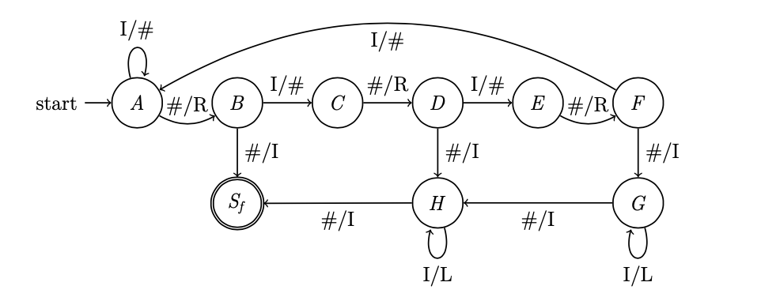

# Theoretische Informatik Sommer Semester 2017

## Aufgabe 1 (11 Punkte)

Endlicher Automat $X = (\lbrace x,y \rbrace, \\{N_0, N_1, K_0, K_1\\},\\{N_0, K_0\\}, \delta \text{ wie Graph },\\{N_1, T_1 \\}) $

### a) 
Finde regulären Ausdruck Z, so dass $L(Z)=L(X)$
### b)
Erstelle den zugehörigen deterministischen endlichen Automaten $X^d$.

## Aufgabe 2 (8 Punkte)

Sei $X = ((x\cup y)z)^*$ ein regulärer Ausdruck.
Erstelle einen endlichen Automaten B, sodass $L(B)=L(X)$.
Benutze hierfür aus der Vorlesung bekannte Vorgehensweißen. Das Tupel muss nicht angegeben werden und der Automat soll nicht minimiert werden.

### Aufgabe 3 (12 Punkte)

### a) 
Sprache $L= \\{x^n y x^m | n,m \in \mathbb{N}; m>n \\}$
Ist die Sprache regulär? Widerlege oder beweise.

### b)
Sprache $L= \{x^n y x^m | n,m \in \mathbb{N}; m+n = 5 \}$
Ist die Sprache regulär? Widerlege oder beweise.

## Aufgabe 4(8 Punkte)
Sprache $L= \{x^n y x^m | n,m \in \mathbb{N}; m>n \}$. Konstruiere einen deterministischen Kellerautomaten B, dessen akzeptierte Sprache gleich L ist.

## Aufgabe 5(14 Punkte)

Endlicher deterministscher Automat $X_1 = (\{a,b\},\{n_0,n_1,n_2,n_3,n_4,n_5,n_6\},n_0, \delta_{X_1}, \{n_1,n_2,n_4,n_6\})$

Zustandsübergangsgraph:

Zustandsübergangstabelle

### a)
Nutze das Minimierungsverfahren und gebe den zu $X_1$ minimalen Automaten $X_{1,m}$ durch seinen Zustandsübergangsgraphen an.

### b)
Zustandsübergangsgraphen von $X_1, X_2, X_3$.

Sind $X_1$ und $X_2$ äquivalent? Sind $X_1$ und $X_2$ isomorph? Mit Begründung!

### c)
Sind $X_1$ und $X_3$ äquivalent? Mit Begründung!

## Aufgabe 6(13 Punkte)
### a)
Sprache $L = \{x^n(yz)^m |n\in \mathbb{N}, m\in \mathbb{N}_0 \}$.
Konstruiere eine Grammatik von möglichst hohem Typ, die L erzeugt.
### b)
Sprache $L = \{x^n y^{m+n}z^k (uv)^{m+k} |n,m,k \in \mathbb{N} \}$
Konstruiere eine Grammatik mit möglichst hohem Typ, die L erzeugt.

## Aufgabe 7(14 Punkte)
Turingautomat T, mögliche Eingaben sind Zahlen in Strichcodierung bzw. Unärdarstellung.

### a)
Welche Konfigurationenfolge durchläuft der Automat für die Eingabe 4?
### b)
Gebe das Tupel von T an.
### c)
Welche Sprache wird von T akzeptiert?
### d)
Für eine Eingabe $n \in \mathbb{N}_n$, überlege welcher Wert auf dem Band liegt, wenn der Automat den Endzustand erreicht. Was berechnet T?
