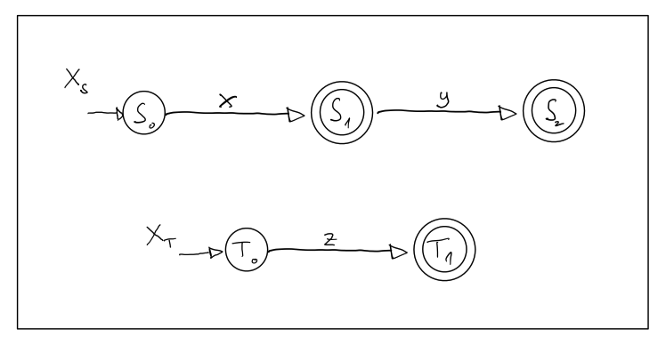
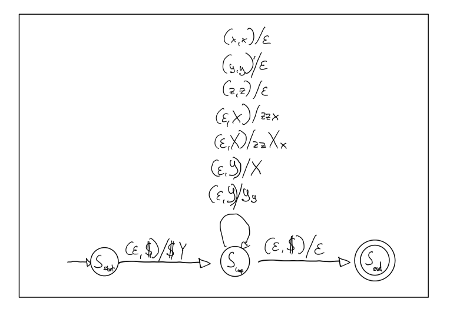

# Klausur Theoretische Informatik Sommer Semester 2020

Prof. Fuhr, Prof Kröner

Bearbeitungszeit: 60 Minuten

Gesammtpunkte: 63

Hilfsmittel: 8 Seiten selbstgefertigte Unterlagen

## Aufgabe 1 (8 Punkte)

Endliche Automaten 
$$
X_S = (\lbrace x,y,z \rbrace, \lbrace S_0, S_1, S_2 \rbrace,\lbrace S_0 \rbrace ,\delta_S wie Graph, \lbrace S_1, S_2 \rbrace) \\
X_T = (\lbrace x,y,z \rbrace, \lbrace T_0, T_1 \rbrace, \lbrace T_0 \rbrace, \delta_T wie Graph, \lbrace T_1 \rbrace )
$$.

Erstelle den endlichen Automaten $(X_S^* \cdot X_T)$ unter Verwendung von aus der Vorlesung bekannten Methoden. Sie müssen kein Tupel angeben und das Ergebniss soll nicht minimiert werden.

## Aufgabe 2 (12 Punkte)

$L = \lbrace x y^m z^n | m,n \in \mathbb{N}, m \geq n \rbrace$ ist eine Sprache. Zeige, dass L keine reguläre Sprache ist.

## Aufgabe 3 (12 Punkte)

Regulärer Ausdruck $R = (x \cup \epsilon) \cdot (y \cup xy)^*$.

### a)
$L_3 = \lbrace w \in L(R) ||w| \leq 3 \rbrace$. Finde alle Wörter dieser Sprache und gebe sie explizit an.

### b)
Finde eine Typ-3 Grammatik (Chomsky) mit der Sonderregel für das leere Wort und $L(G) = L(R) $.

## Aufgabe 4 (7 Punkte)

Konstruiere den Zustandsübergangsgraphen eines endlichen deterministischen Automaten auf dem Alphabet $X=\lbrace x,y,z \rbrace$, der nur alle Wörter akzeptiert, welche mit x anfangen und x enden.

## Aufgabe 5 (8 Punkte)

Kellerautomat $K_G = (\lbrace x,y,z \rbrace, \lbrace x,y,z,X,Y,\$ \rbrace, \$, \lbrace S_{start}, S_{loop}, S_{end} \rbrace, S_{start}, \delta \text{ wie Graph}, \lbrace S_{end} \rbrace ).$

### a)

Finde die Grammatik G auf die der Kellerautomat $K_G$ basiert.

### b)

Finde die Sprache, die von G erzeugt wird.

## Aufgabe 6 (7 Punkte)

Sprache $ L = \lbrace x^n y^{2n} z^m | n \in \mathbb{N}, m \in \mathbb{N}_0 \rbrace $. Erstelle einen deterministischen Kellerautomaten der L über Endzustand akzeptiert. Der Zustandsübergangsgraph genügt.

## Aufgabe 7 (9 Punkte)

Konstruieren Sie einen Turingautomat, der für ein Wort $x \in \lbrace c,d \rbrace^*$ die Anzahl der Buchstaben |x| berechnet und in Unärdarstellung auf das Band legt. Nach durchlaufen des Automaten, stehen nur die Anzahl der Buchstaben auf dem Band und der Lesekopf steht auf Anfang. Es genügt den Zustandsübergangsgraphen anzugeben.