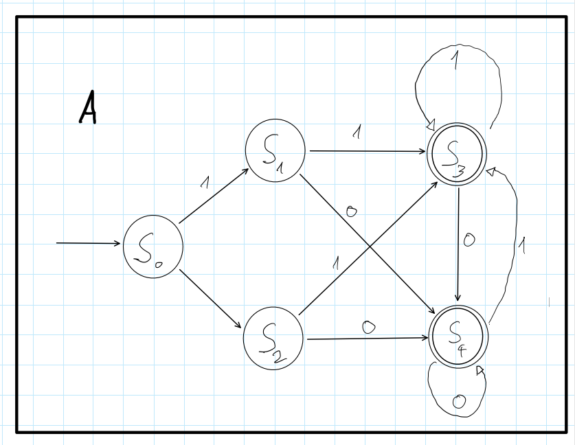

# Klausur Theoretische Informatik Sommer Semester 2021

Prof. Löhr, Prof Kröner

Bearbeitungszeit: 60 Minuten

Gesammtpunkte: 62

Hilfsmittel: 8 Seiten selbstgefertigte Unterlagen - geheftet mit Namen

## Aufgabe 1 (10 Punkte)

Regulärer Ausdruck $R = z\cdot ( x \cup xy)^*$ . 

### a)

Sprache $L = \lbrace w \in L(R) || w | \leq 3 \rbrace $. Finde alle Wörter von L und gebe sie sortiert nach der Länge an. 

### b)

Erstelle beginnend mit elementaren Automaten für die Buchstaben einen endlichen Automaten, dessen akzeptierte Sprache L ist. Benutze hierfür das Vorgehen aus der Vorlesung und mache die einzelnen Schritte durch Kästen und Farben deutlich.

## Aufgabe 2 (10 Punkte)

Sprache $L = \lbrace xy^mz^n|m,n \in \mathbb{N}; n = m + 3 \rbrace $. Zeige, dass L nicht regulär ist.

## Aufgabe 3 (10 Punkte)

Endlicher deterministscher Automat $A = (\lbrace 0,1\rbrace, \lbrace S_0, S_1,S_2,S_3,S_4 \rbrace , S_0, \delta_A \text{ wie Graph }, \lbrace S_3,S_4 \rbrace)$.

Minimiere A mit dem aus der Vorlesungs bekannten Minimierungsverfahren. Alle im Minimierungsverfahren verwendeten Zwischenschritte müssen angegeben werden. Gebe für den Minimalautomaten sowohl den Zustandsübergangsgraphen also auch den Tupel an. 

## Aufgabe 4 (8 Punkte)

Grammatik $G = (\lbrace X, Y,Z \rbrace, \lbrace x,y,z \rbrace, X, P)$ mit den Produktionen 

$P = \lbrace X \rightarrow Y, Y \rightarrow yyZ|xYyZ, Z \rightarrow y \rbrace $.

### a)

Leite das Wort 

$w = xyyzyz$

schrittweise aus dem Startsymbol ab. 

### b)

Erstelle den Kellerautomaten, der zur Grammatik G zugeordnet ist.

## Aufgabe 5 (10 Punkte)

Sprache $S = \lbrace x^{n+1}y^{2n} | n \in \mathbb{N} \rbrace $. Erstelle einen deterministischen Kellerautomaten K mit $L(K) = L(S)$. Der Kellerautomaten soll mit leerem Keller akzeptieren. Das Tupel muss nicht angegeben werden.

## Aufgabe 6 (6 Punkte)

Grammatik 

$G = (\lbrace X,Y,Z \rbrace, \lbrace y,z \rbrace ,X, P )$

mit den Produktionen 

$P = \lbrace Y \rightarrow Z|YyZ, Z\rightarrow zz , X \rightarrow Y \rbrace $.

Bilde die Typ-2 Normalform von G. Für jeden Schritt des Verfahrens muss die Produktionsmenge angegeben werden. Ein Tupel ist nicht notwendig.

## Aufgabe 7 (8 Punkte)

Alphabet $X = \lbrace a,b, \\$ \rbrace $.

Funktion f:

$ f: a^n \rightarrow \\$ b^{n-1} $.

Für alle $n \in \mathbb{N} $. z.B.: 

$f(aaa) = \\$bb$.

Erstelle eine deterministische Turingmaschine T, welche die gleiche Berechnung wie $f$ ausführt. 

Die Eingabe kann als Gültig vorrausgesetzt werden und nach der Berechnung soll der Lesekopf ganz links des Ergebnisses stehen.
